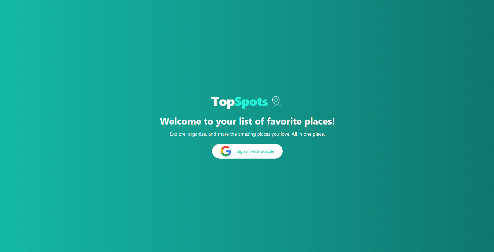
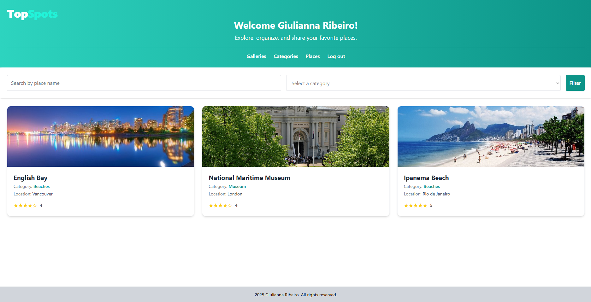

# 🌍 TopSpots

TopSpots is a web application built with **Angular 18** that allows users to list, view, and filter their **favorite places**. The system uses **Google OAuth2** for authentication and simulates a REST API with **JSON Server**. With a fully responsive design, the project focuses on performance, best practices, and a clean interface using **TailwindCSS**.

---

## ✅ Features

- **Google Login (OAuth2):** Simplified and secure authentication  
- **Place Display:** Shows image, name, category, and rating  
- **Dynamic Filtering:** Real-time search by name and category  
- **Category Management:** Categories list handled via JSON  
- **Rating System:** Star-based rating display  
- **Route Protection:** AuthGuard implementation for secure routes  
- **Responsive Design:** Built with TailwindCSS for consistent experience across devices
- **Docker Support:** Production-ready Dockerfile for containerized deployment

---

## 🛠️ Technologies

- Angular 18 (with Router, Lazy Loading, Route Data)
- Angular Material (MatSnackBar)
- TailwindCSS  
- JSON Server  
- TypeScript  
- Angular OAuth2 OIDC
- RxJS + Signals
- Lottie Animations (ngx-lottie + lottie-web)

---

## 🚀 Installation & Running

1. **Clone the repository**  
   ```bash
   git clone https://github.com/GiuliannaRibeiro/topspots.git
   cd topspots
   ```
   
2. **Install dependencies**  
   ```bash
   npm install
   ```

3. **Start the fake API**  
   ```bash
   npm run server
   ```
   
4. **Run the Angular application**  
   ```bash
   ng serve -o
   ```

---

## 🖼️ App Preview

- **Login Screen**  


- **Places Gallery**  


